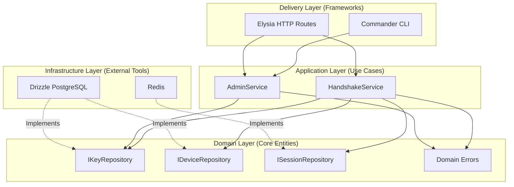

# How Keyzori is structured

Keyzori License Manager uses strict clean architecture. Business logic does not directly depend on Elysia, Drizzle, PostgreSQL, or Redis.

Instead, dependencies flow inward toward the core Domain layer.

## Keyzori layers

### 1. Domain Layer (`src/domain/`)
The absolute core of the application. It contains no implementation details. It defines the interfaces for the repositories (`IKeyRepository`, `IDeviceRepository`, `ISessionRepository`) and the core application errors (`DomainError`, `NotFoundError`).

### 2. Application Layer (`src/application/`)
This layer holds the pure business logic. `HandshakeService` and `AdminService` are completely agnostic of HTTP requests or SQL queries. They expect their dependencies to be injected into their constructors, making them 100% unit-testable in isolation using mocks.

### 3. Infrastructure Layer (`src/infrastructure/`)
This layer implements the interfaces defined in the Domain. 
- `DrizzleKeyRepository` talks to PostgreSQL through Drizzle ORM.
- `DrizzleDeviceRepository` serializes per-license device registration with PostgreSQL advisory transaction locks.
- `RedisSessionRepository` atomically tracks concurrent sessions and TTLs through Redis Lua.

### 4. Delivery Layer (`apps/server/src/controllers/` and `apps/server/src/cli/`)
The outer boundary. Elysia controllers map HTTP requests into application calls and translate domain errors into HTTP responses. Commander commands are a second inbound adapter that invokes `AdminService` directly. Neither interface contains business rules or talks to Drizzle itself.

### 5. Composition (`apps/server/src/composition/`)
The composition root creates infrastructure repositories and injects them into application services. Both HTTP and CLI entrypoints use this shared wiring, preventing the two operator interfaces from drifting.

## Deployment boundary

`keyzori-server` and `keyzori-admin` are built from the same server workspace and shipped in the same container. The HTTP process uses PostgreSQL and Redis. An operator runs the CLI as a short-lived process inside that container; it uses PostgreSQL directly and does not loop back through HTTP or require an admin API credential.
