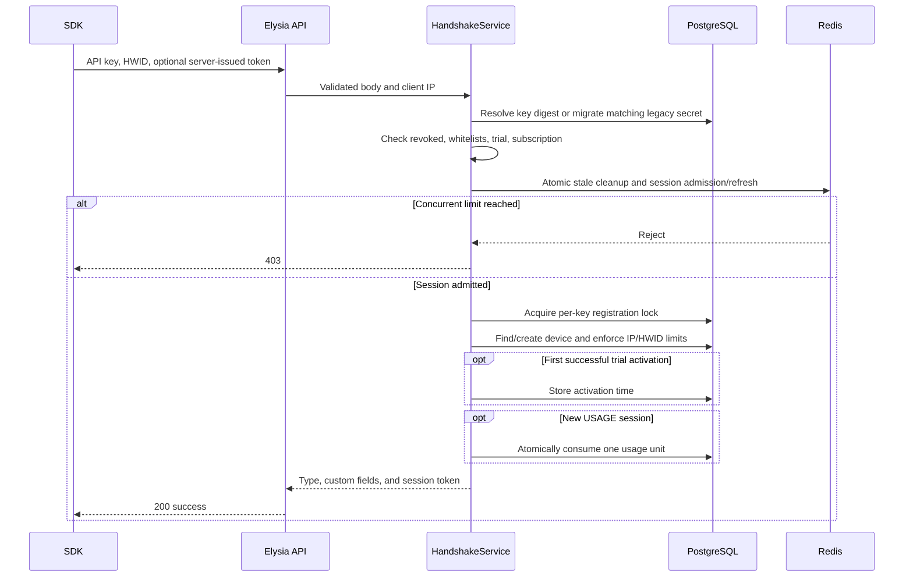

# How Keyzori validates a license

The SDK uses `POST /v1/handshake` for initial validation and heartbeat refreshes.

Redis issues an unguessable token only after atomically removing stale members and checking the concurrent limit. It stores a hash of the admission IP/HWID context, and heartbeats can refresh a token only when that context still matches. PostgreSQL uses a per-license advisory transaction lock so parallel device registrations cannot exceed IP or HWID limits, and USAGE debit occurs inside that same transaction as device mapping.

Validation stops at the first failure and returns a structured `403` error. Existing sessions skip concurrency admission and usage charging but still re-check revocation, expiry, whitelists, and IP/HWID rules.

If a newly admitted session later fails device validation, trial activation, or usage charging, Keyzori removes that Redis session before returning the error.

The official SDK waits 30 seconds by default after each completed heartbeat. Successful heartbeats reset retry strikes. At two consecutive retryable failures by default, it emits `network:offline` and destroys itself. Calling `destroy()` sends `/v1/logout`, releasing the slot without waiting for TTL expiry.
